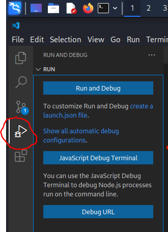
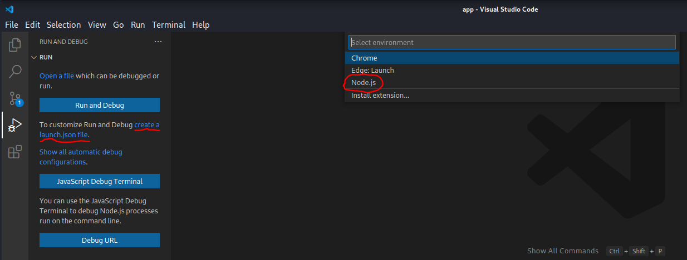
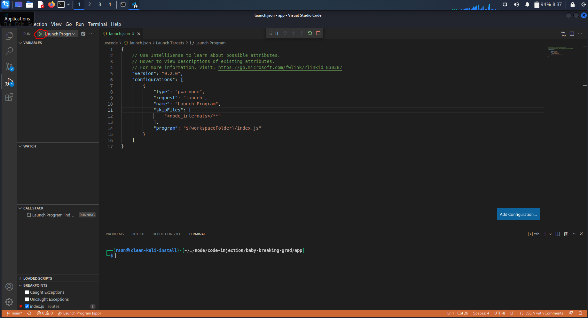

# NodeJS - Debug Setup

1. Install Node Package Manager (NPM):
```
sudo apt install -y npm
```

2. Navigate to the application directory:
```
cd code-injection/baby-breaking-grad/app
```

3. Install requred packages for the challenge:
```
npm install
```

4. Open the application directory in VS Code:
```
code .
```

5. In VS Code, select the 'Run and Debug' icon of the left side of the GUI:



6. Click the 'create a launch.json file' link and select 'Node.js' to generate a launch.json file:




Example launch.json file:
```
{
    // Use IntelliSense to learn about possible attributes.
    // Hover to view descriptions of existing attributes.
    // For more information, visit: https://go.microsoft.com/fwlink/?linkid=830387
    "version": "0.2.0",
    "configurations": [
        {
            "type": "pwa-node",
            "request": "launch",
            "name": "Launch Program",
            "skipFiles": [
                "<node_internals>/**"
            ],
            "program": "${workspaceFolder}/index.js"
        }
    ]
}
```

7. Click the green play button to run the application w/ debugging:

